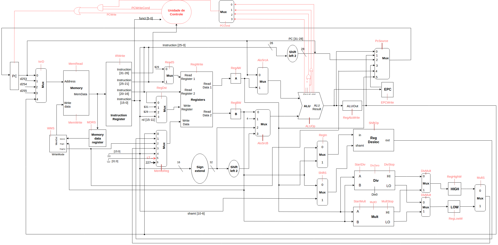
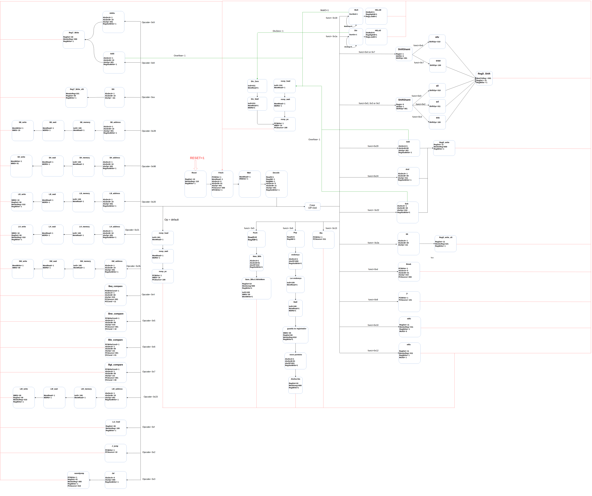

# What is MipsCPU?
 MipsCPU is a design and implementation project of a RISC microprocessor with a similar Mips instructions set

## Microprocessor design
 
 
## Design features
 * Multi Cycle
 * 32 registers
 * 32-bit words (4 byte boundaries)
 * Extra instructions (Push, Pop)

## State machine
 

## Implementation tools
 * Hardware Description Languages: SystemVerilog, Verilog
 * Software for testing: Intel Quartus Prime

## Group
 the creators of this project are the following Computer Engineering students:
 * [Matheus Ferreira](https:://github.com/PunishedBois) (email: mfbs@cin.ufpe.br)
 * [Gabriela Leal](https:://github.com/gabrielaleal) (email: @cin.ufpe.br)
 * [Beatiz Alvez](https:://github.com/) (email: @cin.ufpe.br)
 * [Marcos Monteiro](https://github.com/marcosmmb) (email: @cin.ufpe.br)
 * [Nathalia Paiva](https://github.com/naftlima) (email: @cin.ufpe.br)

